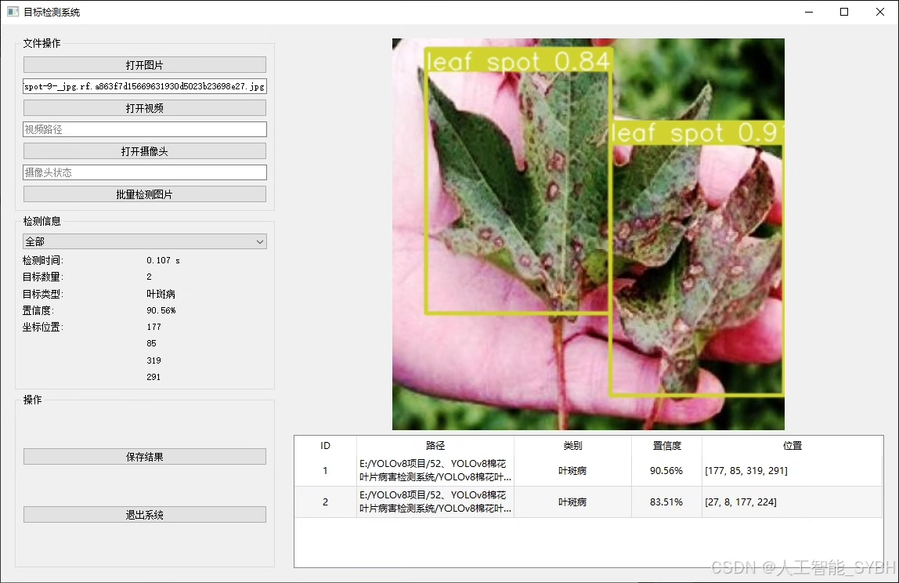
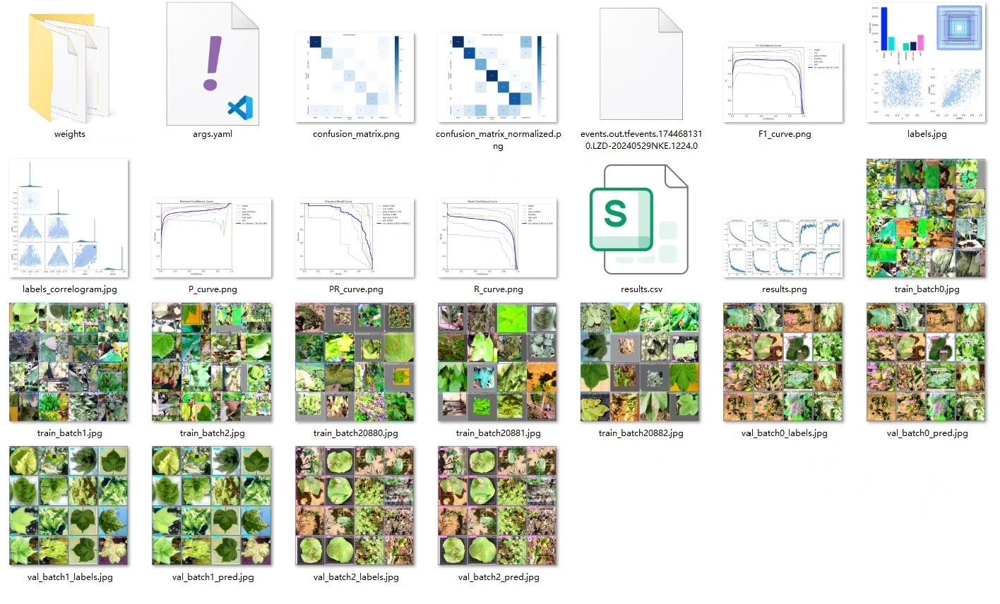
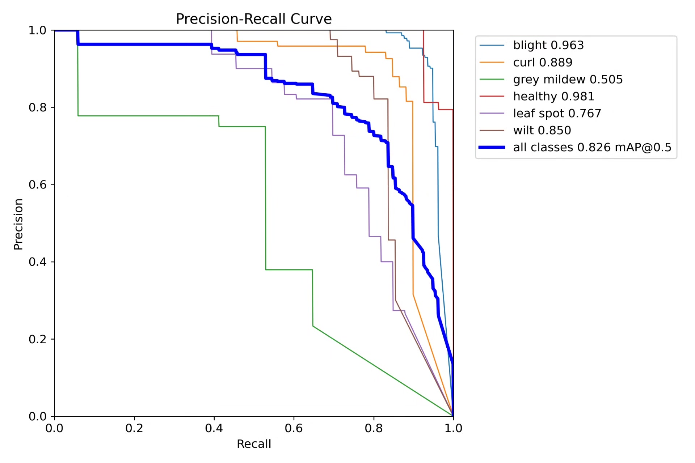
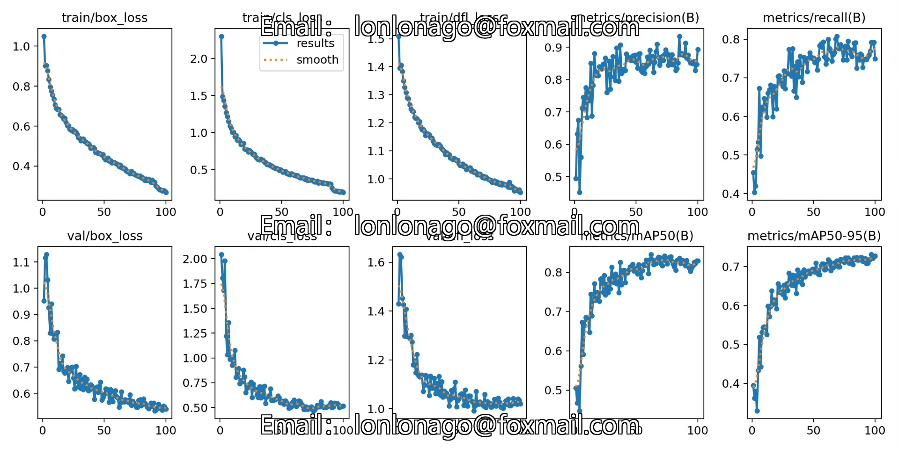
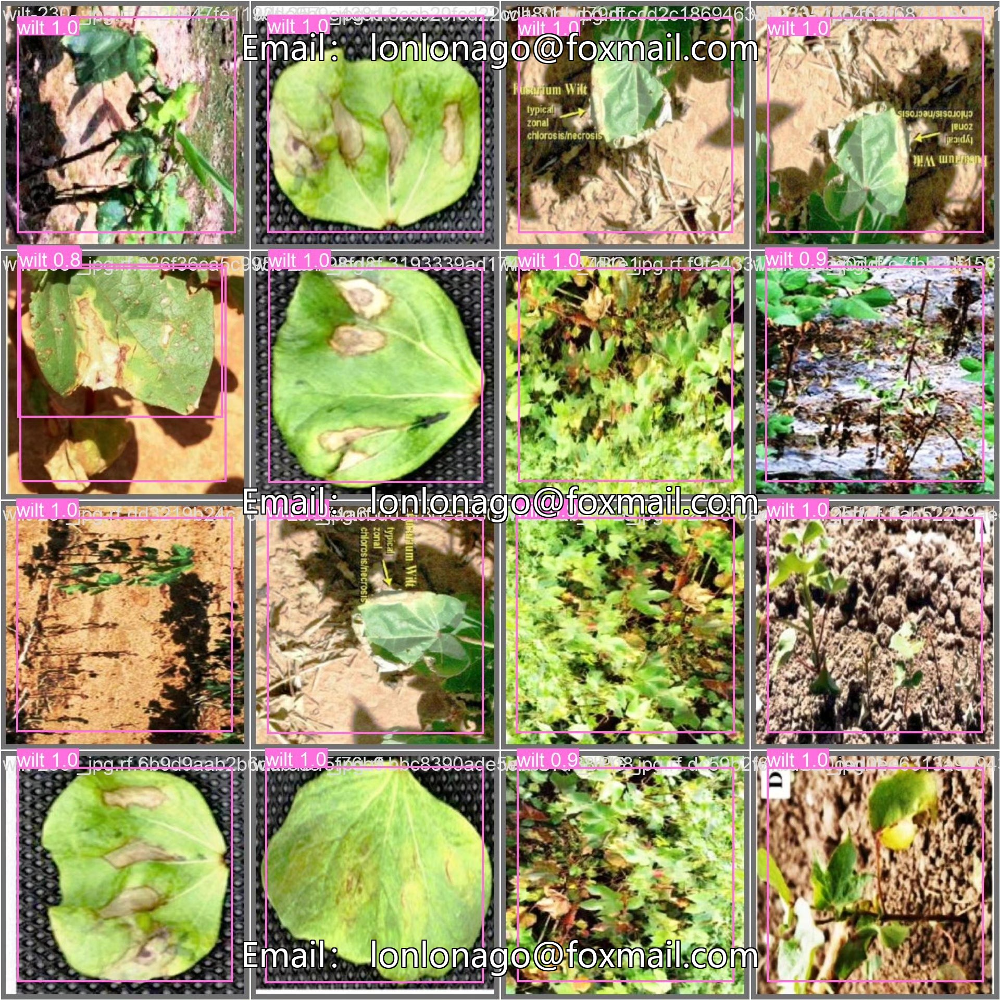
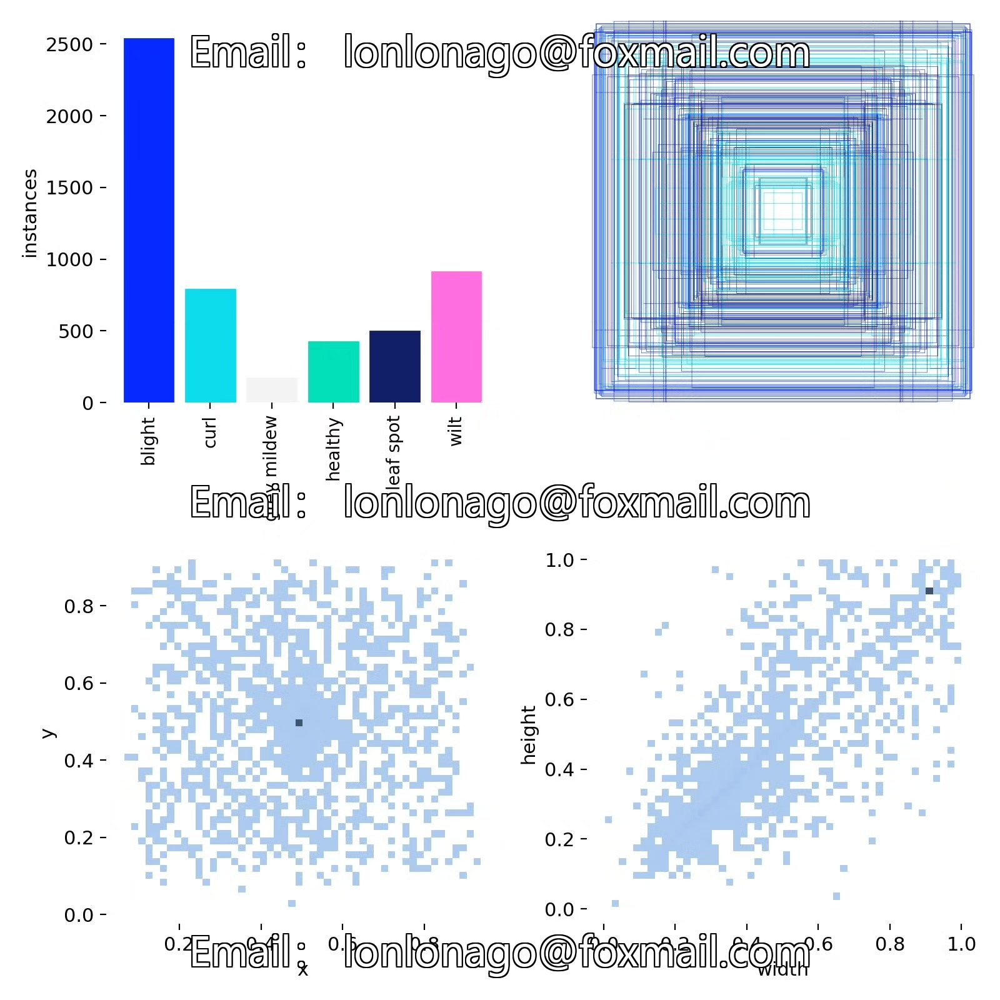
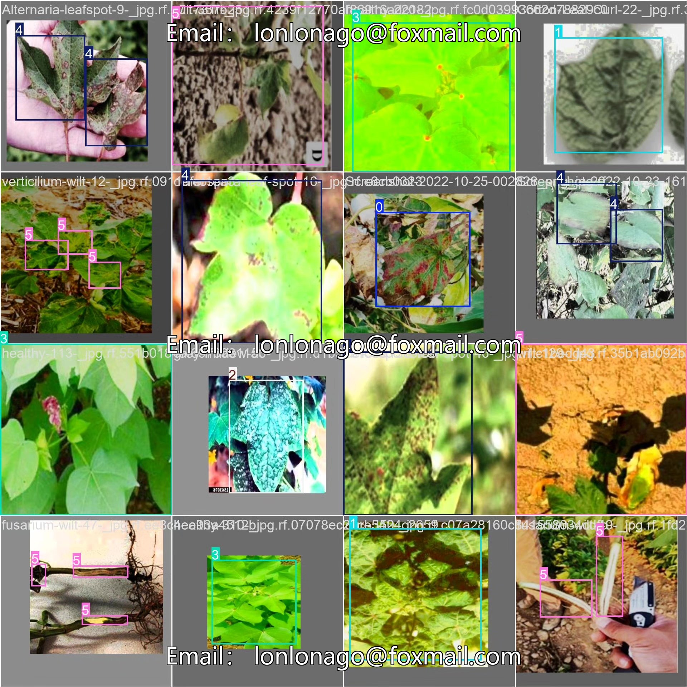

# Based on YOLOv8 deep learning for cotton leaf disease detection system (YOLOv8)

## Body

Based on the YOLOv8 deep learning algorithm, we have developed a high-efficiency and precise intelligent detection system for cotton leaf diseases. This system can automatically recognize six different states of cotton leaves, including blight (blight), curl (curl), grey mildew (grey mildew), healthy leaf (healthy), leaf spot (leaf spot), and wilt (wilt). The dataset includes a training set of 3708 images, a validation set of 232 images, and a test set of 233 images, totaling 4173 high-quality labeled images to ensure that the model has good generalization capabilities.

Our company's products have obtained the official commercial license certification from YOLO.
We provide after-sales service.
After payment, we will provide WeChat IDs to answer questions anytime.
Environment configuration: We will provide an environment configuration tutorial, and WeChat will provide answers in a timely manner.
Remote installation services: If you need remote configuration, an additional fee of 69 is required, with all fees refunded if the configuration fails (only refund installation fees for older computers).
Retraining the dataset: After configuring the environment, you can train on your own computer. If you need us to retrain, just pay 69 plus computing power fees (2.5 yuan/hour).
Full after-sales service

## Images

## Payment

Here is a pay link on Stripe ( https://buy.stripe.com/3cs8yP7sY87d0vu9AB ). Please contact me lonlonago@foxmail.com after funding $89, and I will send you a complete data files , thank you!

